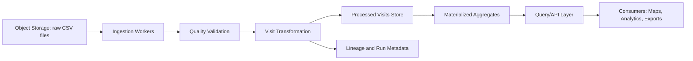
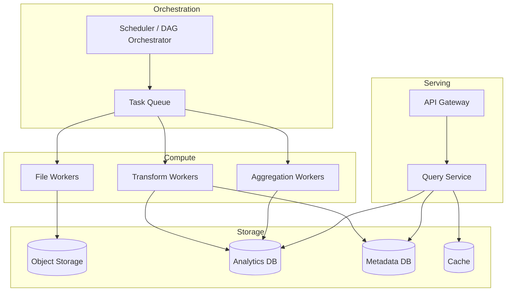

## Production Architecture

This document covers the production-scale design for billions of pings/day and thousands of files/day.

## 1) End-to-End Data Flow

## 2) Runtime Architecture

## 3) ETL Pipeline Architecture

- File-level fan-out with worker pools.
- Checkpointed and idempotent processing via manifest/state machine.
- Retry with failure isolation at file/chunk scope.
- Backfill by partition window, not full reprocess by default.

## 4) Database and Storage Architecture

- Analytics DB for visits and aggregates (columnar in production).
- Metadata DB for runs, lineage, and processing state.
- Partition by date; cluster by geography/device dimensions.
- Hot aggregate tables for map analytics.

## 5) API and Query Layer

- Read-only query service for visit analytics.
- Bounded contracts (time-range, bbox, limits, pagination).
- Cache for frequent heatmap and summary requests.
- Rate limiting and query guards to protect backend.

## 6) Scaling Strategy

- 1M/day: single region, modest worker pool.
- 1B/day: autoscaled workers, partitioned compute queues, aggressive pre-aggregation.
- 10B+/day: multi-cluster storage, tiered retention, workload isolation by tenant/use-case.

## 7) Reliability, Monitoring, and Cost

- SLOs on ingest latency, successful run ratio, API p95.
- Metrics/logs/traces for pipeline and query service.
- DLQ and replay pipeline for failed units.
- Cost control via incremental processing, storage tiering, and autoscaling bounds.
