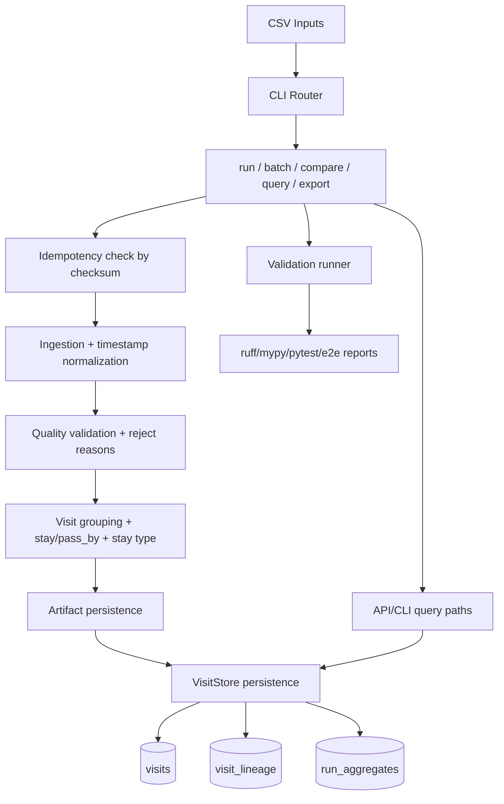

# Full Solution Documentation

## Executive Summary

This solution implements a complete local prototype for the location-data assessment:
- ETL from raw pings to visit records;
- query-ready persistence with lineage;
- API/query interfaces for required use cases;
- production-scale architecture design and migration path.

The implementation is aligned to `assessment.md` Parts 1-4, with explicit rationale and
trade-offs documented per domain.

## End-to-End Flow (Short)

1. Input CSV is ingested and normalized.
2. Quality rules split accepted and rejected records.
3. Accepted pings are grouped into visits and classified.
4. Artifacts and quality report are written.
5. Visits and lineage are persisted to SQLite.
6. Run-level analytics are materialized for fast read paths.
7. API/CLI query layers expose map and journey use-cases.
8. Validation runner enforces static checks, tests, and e2e policy.

## End-to-End Flow (Detailed)

## Alignment to `assessment.md`

| Part | Requirement | Solution Status | Primary Evidence |
|---|---|---|---|
| Part 1 | ETL Pipeline (code) | Implemented | `src/pipeline/phase1.py`, `src/transformation/grouping.py` |
| Part 2 | Database Architecture (design + schema) | Implemented in prototype + documented for production | `src/storage/visit_store.py`, domain doc Part 2 |
| Part 3 | API/Query Layer (design) | Implemented for required use-cases + documented contracts | `src/api/app.py`, domain doc Part 3 |
| Part 4 | Production Architecture (design) | Fully documented with scaling path and trade-offs | domain doc Part 4 |

## Repository-Level Documentation Map

- Canonical index: `docs/solution/README.md`
- ETL domain: `docs/solution/domains/part1_etl_pipeline.md`
- DB domain: `docs/solution/domains/part2_database_architecture.md`
- API domain: `docs/solution/domains/part3_api_query_layer.md`
- Production architecture domain: `docs/solution/domains/part4_production_architecture.md`
- Technology decisions: `docs/solution/appendix/technology_decisions.md`
- Diagrams pack: `docs/solution/appendix/system_diagrams.md`
