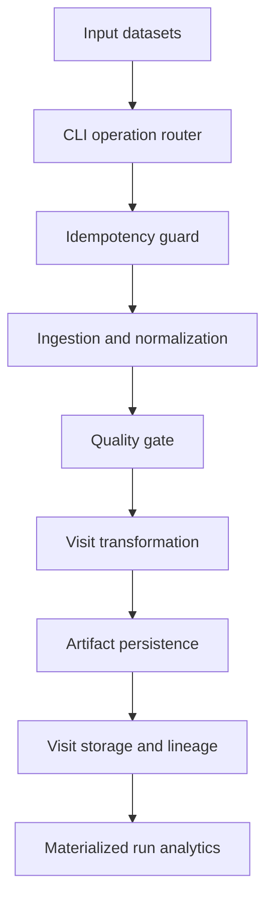
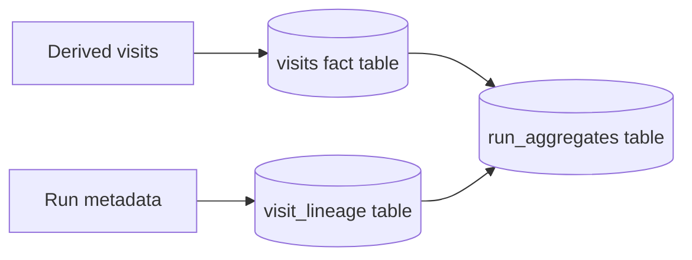
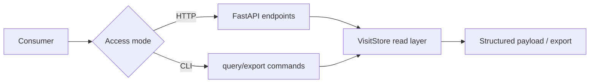
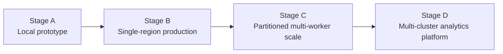

# System Diagrams Appendix

This appendix contains standardized diagrams for architecture communication.
Each diagram is paired with usage notes so it can be reused in reports and presentations.

## A) ETL Control and Processing Flow

**Use this diagram when:** explaining how a single run progresses from raw input to persisted outputs.

## B) Storage and Lineage Topology

**Use this diagram when:** explaining schema roles and auditability boundaries.

## C) Serving Paths (HTTP and CLI)

**Use this diagram when:** clarifying that API and CLI share one read model.

## D) Production Scale Evolution

**Use this diagram when:** discussing capacity planning and migration sequencing.

## Diagram Usage Rules

- Keep node names semantic (role-oriented, not implementation trivia).
- Keep arrows directional by data or control ownership.
- Avoid crossing lines unless the relationship is essential.
- Use one diagram per question (execution, storage, serving, or scaling).
