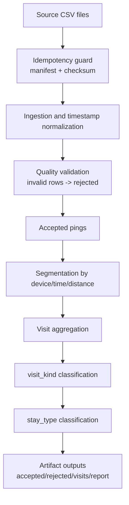

# Part 1: ETL Pipeline (assessment.md 91-92)

## Assessment Requirements (Short)

Implement working code for:
- ingestion of raw ping CSV data;
- quality validation and rejection handling;
- grouping pings into visits;
- classifying visits into `stay` or `pass_by`;
- classifying stay type with simple behavior rules.

## Solution Summary (Short)

The solution implements an idempotent ETL pipeline that transforms raw pings into
query-ready visits and emits auditable artifacts and reports for each run.

## Process Flow (Detailed)

## Detailed Logic

### Ingestion and quality
- Normalizes timestamps and schema before transformation.
- Handles optional `accuracy_m` safely.
- Tracks reject reasons for observability and debugging.

### Visit grouping
- Primary segmentation boundary = time gap + spatial displacement.
- Spatial boundary is accuracy-aware to avoid over-splitting noisy GPS.
- Night-gap bridge reduces false split risk in overnight residential-like patterns.

### Classification
- `stay` vs `pass_by` uses duration and ping count thresholds.
- `stay_type` baseline taxonomy uses time-window and duration heuristics (`home/work/other`).

## Rationale for Algorithm Choices

- **Deterministic rules:** easy to reason about, validate, and explain during assessment review.
- **Configurable thresholds:** allows rapid calibration without changing core code.
- **Accuracy-aware segmentation:** practical guard against GPS noise bias.

## Strengths and Trade-offs

### Strengths
- Reproducible outputs with strong traceability.
- Good explainability for algorithm decisions.
- Fast local iteration and straightforward testing.

### Trade-offs
- Rule-based logic can miss nuanced behavioral patterns.
- No personalized user history model in prototype scope.
- Cross-file long-visit continuity is intentionally conservative.

## Data Contract (Key Output Fields)

- `visit_id`, `device_id`
- `visit_kind`, `stay_type`
- `start_ts_utc`, `end_ts_utc`
- `duration_seconds`, `ping_count`
- `representative_latitude`, `representative_longitude`

## Evidence in Code

- `src/pipeline/phase1.py`
- `src/transformation/grouping.py`
- `src/quality/validator.py`
- `tests/test_transformation.py`
- `tests/test_pipeline_integration.py`

## Production Hardening Path

1. Add richer mobility features and optional model-assisted classification.
2. Introduce partition-aware continuity for visits crossing file boundaries.
3. Keep current output contract stable; version only when semantics change.
