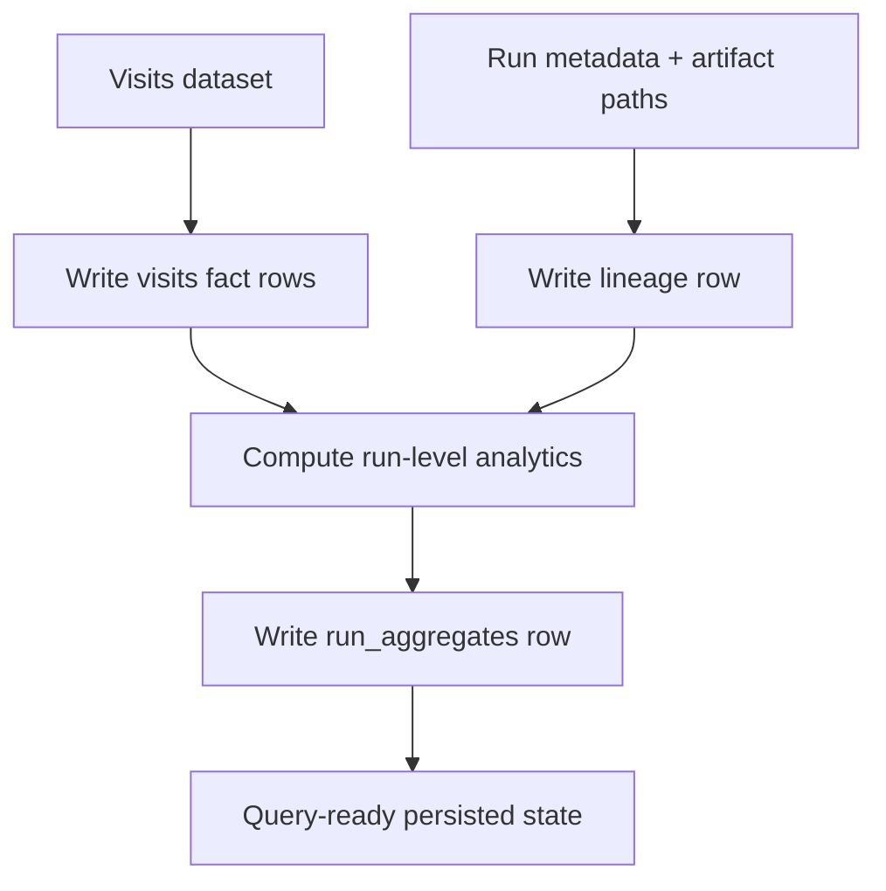

# Part 2: Database Architecture (assessment.md 113-114)

## Assessment Requirements (Short)

Define schema and architecture for processed visits, including:
- supporting metadata and lineage;
- indexing and partitioning strategy;
- incremental ingestion behavior;
- justification of technology choices.

## Solution Summary (Short)

The prototype uses SQLite to persist visits, lineage, and materialized run aggregates.
The schema is intentionally shaped to map cleanly to production-scale analytical storage.

## Storage Flow (Detailed)

## Schema Design (Prototype)

### `visits`
- Visit-level fact table with derived behavioral attributes.
- Optimized for journey and aggregation reads.

### `visit_lineage`
- Run-level provenance: source file, checksum, algorithm, counts, output paths.
- Primary audit trail for reproducibility and traceability.

### `run_aggregates`
- Materialized analytics snapshot per run.
- Reduces repeated expensive aggregation scans for common query paths.

## Indexing and Query Shape

- `device_id + start_ts_utc` index supports ordered journey retrieval.
- Aggregate queries operate on already transformed visit-level data (not raw pings).

## Incremental and Idempotent Behavior

- File-level checksum in manifest prevents duplicate successful reprocessing.
- New data creates new `run_id`; historical lineage remains auditable.

## Technology Rationale

- **Why SQLite now:** zero-ops, deterministic local execution, low setup friction.
- **Why this schema shape:** contracts mirror production concerns (fact, lineage, pre-aggregates).

## Strengths and Trade-offs

### Strengths
- Clear and practical lineage model.
- Strong local reproducibility.
- Fast onboarding for reviewers and maintainers.

### Trade-offs
- SQLite write concurrency limits at large scale.
- No native horizontal partitioning/sharding.
- Requires migration for strict low-latency/high-volume production SLOs.

## Evidence in Code

- `src/storage/visit_store.py`
- `src/pipeline/phase1.py`
- `src/pipeline/cli.py`
- `tests/test_phase3_storage.py`
- `tests/test_phase4_analytics.py`

## Production Hardening Path

1. Split storage planes:
   - analytics fact store (columnar),
   - metadata/control store (OLTP).
2. Partition by time, cluster by geography/device dimensions.
3. Add materialized views for hot heatmap and journey windows.
4. Introduce retention tiers and replay-safe backfill mechanisms.
