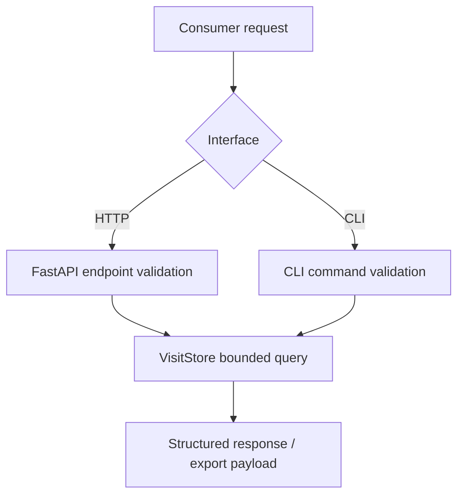

# Part 3: API/Query Layer (assessment.md 131-132)

## Assessment Requirements (Short)

Provide access design for two key use cases:
1) Location analytics / heatmap data.
2) Device journey / visit details.

## Solution Summary (Short)

The solution provides both HTTP and CLI access surfaces backed by the same read model:
- HTTP: `GET /api/map/data`, `GET /api/devices/{device_id}/journey`
- CLI: `query phase3`, `query phase4`, `export phase4`

## Access Flow (Detailed)

## API Contract Principles

- **Bounded requests:** time ranges, bbox, and `limit` controls.
- **Read model separation:** endpoints query visits, not raw ping stream.
- **Stable payloads:** response structure remains predictable across runs.

## Rationale for Chosen Approach

- FastAPI provides typed input validation and low-friction delivery.
- Shared query logic in `VisitStore` avoids divergence between API and CLI behavior.
- Bounded query contracts support predictable scaling and cost control.

## Strengths and Trade-offs

### Strengths
- Covers required assessment use-cases directly.
- Simple, testable, and easy to demonstrate.
- Unified query behavior across interfaces.

### Trade-offs
- Prototype hardening level: no full auth/tenant/rate policy stack yet.
- Advanced caching and query planner controls are design-level for production.

## Evidence in Code

- `src/api/app.py`
- `src/pipeline/cli.py`
- `src/storage/visit_store.py`
- `tests/test_api_layer.py`
- `tests/test_phase4_export.py`
- `docs/solution/appendix/api_playground_guide.md` (review and demo surface details)

## Production Hardening Path

1. Introduce API gateway and policy enforcement (authn/authz, quotas).
2. Add multi-layer cache for hot map windows.
3. Add pagination/cursor contracts and strict timeout/backpressure policies.
4. Track API SLOs (latency/error/timeout) with alerting and autoscaling triggers.
