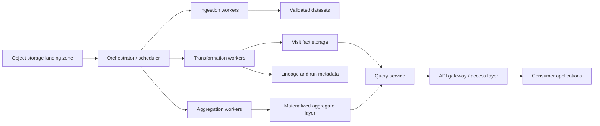

# Part 4: Production System Architecture (assessment.md 177-178, 179-192)

## Assessment Requirements (Short)

Provide production architecture for billion-scale processing that covers:
- ETL orchestration, parallelism, and failure handling;
- database and storage strategy;
- API/query optimization and serving reliability;
- infrastructure and cost controls;
- explicit scaling path from prototype to 1B+/10B+.

## Solution Summary (Short)

The architecture is modeled as layered planes (control, processing, storage, serving,
observability) with staged scale evolution and migration triggers.

## Reference Architecture (Detailed)

## Scale Model and Transition Triggers

| Stage | Throughput envelope | Focus | Trigger to move forward |
|---|---|---|---|
| A: Prototype | up to ~1M/day | correctness and contract stability | pipeline window breaches or lock/contention symptoms |
| B: Single-region prod | ~1M-100M/day | reliability + baseline SLOs | queue backlog growth, p95 regressions, cost escalation |
| C: Partitioned scale | ~100M-1B/day | partitioned workers + pre-aggregation | hotspot partitions and sustained retry pressure |
| D: Multi-cluster | 1B-10B+/day | workload isolation and strong multi-tenant controls | cross-cluster saturation or tenant interference |

## Operational Watchpoints (What matters most)

- Queue age, retry ratio, and dead-letter volume.
- Step p95/p99 (`ingest`, `transform`, `persist`, `aggregate`).
- Data quality drift (reject reasons, schema drift events).
- API p95/p99, timeout rate, and saturation signals.
- Cost per million pings and per query class.

## Architecture Rationale

- **Layered decomposition:** isolates concerns and enables independent scaling.
- **Pre-aggregation strategy:** improves query latency and cost at high volume.
- **Lineage-first discipline:** supports auditability, replay safety, and incident recovery.

## Strengths and Trade-offs

### Strengths
- Clear prototype-to-production migration path.
- Strong contract continuity across scale stages.
- Good observability anchors for SLO-driven operations.

### Trade-offs
- Production controls are designed but not fully deployed in this repository.
- Advanced security/compliance/dr posture remains implementation backlog.

## Implementation Priorities

1. Managed orchestration with replay/DLQ and policy-based retries.
2. Storage migration to analytics + metadata plane split.
3. Query acceleration via materialized views and caching.
4. End-to-end SLO instrumentation with alerting and runbooks.
